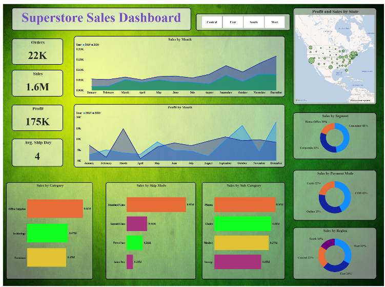
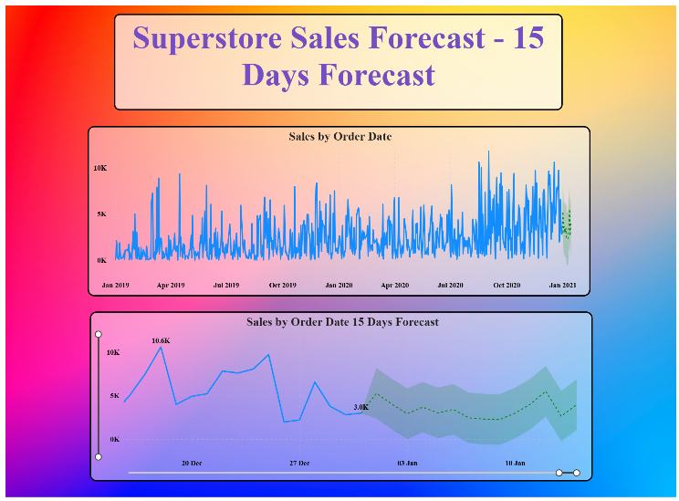

# 📊 Superstore Sales Dashboard | Power BI

## 📌 Project Overview

This project analyzes Superstore sales data using **Power BI** to uncover insights related to sales performance, profitability, customer segments, product categories, shipping methods, regional performance, and payment behavior.

The project also includes a **15-day sales forecast**, extending the analysis beyond historical performance to provide a short-term view of expected sales.

---

## 🎯 Business Objective

The objective of this project is to transform transactional Superstore data into an interactive business intelligence dashboard that helps understand overall business performance and identify important sales patterns.

The analysis focuses on questions such as:

- What are the overall sales, profit, and order volumes?
- Which product categories and sub-categories generate the most sales?
- Which regions contribute the largest share of sales?
- Which customer segments contribute the most revenue?
- Which shipping methods are used most frequently?
- How do sales and profit change throughout the year?
- Which payment methods contribute the most sales?
- How does performance vary across different states?
- What does the short-term sales forecast indicate?

---

## 📊 Key Performance Indicators

| KPI | Result |
|---|---:|
| **Total Orders** | **22K** |
| **Total Sales** | **1.6M** |
| **Total Profit** | **175K** |
| **Average Ship Days** | **4 Days** |

---

## 🛠️ Tech Stack

| Technology | Purpose |
|---|---|
| **Power BI** | Dashboard development and data visualization |
| **Power Query** | Data preparation and transformation |
| **DAX** | KPI and analytical calculations |
| **CSV** | Source dataset |

---

## 🔄 Analysis Workflow

```text
Superstore Sales Dataset
        ↓
Data Preparation
        ↓
Data Transformation
        ↓
KPI Development
        ↓
Sales & Profit Analysis
        ↓
Power BI Dashboard
        ↓
15-Day Sales Forecast
        ↓
Business Insights
```

---

## 🔍 Sales Analysis

The dashboard analyzes business performance across multiple dimensions.

### 📦 Product Performance

Sales were analyzed by both **Category** and **Sub-Category** to identify the strongest product groups.

**Sales by Category:**

- Office Supplies — **0.64M**
- Technology — **0.47M**
- Furniture — **0.45M**

**Leading Sub-Categories:**

- Phones — **0.20M**
- Chairs — **0.18M**
- Binders — **0.17M**
- Storage — **0.15M**

### 🚚 Shipping Analysis

Sales were analyzed across different shipping methods:

- Standard Class — **0.91M**
- Second Class — **0.31M**
- First Class — **0.24M**
- Same Day — **0.10M**

Standard Class accounts for the largest sales volume among the available shipping modes.

### 🌎 Regional Performance

Sales contribution by region:

- West — **33%**
- East — **29%**
- Central — **22%**
- South — **16%**

The **West region** contributes the largest share of overall sales.

### 👥 Customer Segment Analysis

Sales contribution by customer segment:

- Consumer — **48%**
- Corporate — **33%**
- Home Office — **19%**

The **Consumer segment** represents the largest share of sales.

### 💳 Payment Mode Analysis

Sales contribution by payment method:

- COD — **43%**
- Online — **35%**
- Cards — **22%**

COD represents the largest share among the payment methods shown in the dashboard.

---

## 💡 Key Business Insights

- **Office Supplies** is the highest-selling product category at approximately **0.64M**.
- **Phones** lead the analyzed sub-categories with approximately **0.20M** in sales.
- **Standard Class** dominates shipping-mode sales at approximately **0.91M**.
- The **West region** generates the largest regional sales contribution at **33%**.
- **Consumers** account for the largest customer segment, contributing **48%** of sales.
- **COD** is the leading payment mode with a **43%** share.
- Monthly sales and profit patterns vary across 2019 and 2020, highlighting changes in business performance over time.
- The dashboard provides state-level sales and profit analysis for geographic performance comparison.

---

## 📊 Power BI Dashboard

### 🏠 Superstore Sales Overview



The main dashboard provides a consolidated view of overall sales performance, including KPIs, monthly trends, product performance, customer segments, shipping modes, payment methods, regional contribution, and state-level performance.

---

## 🔮 15-Day Sales Forecast



The second dashboard page extends the historical sales analysis with a **15-day sales forecast based on order-date sales data**.

The forecast visualization provides a short-term view of expected sales behavior and demonstrates the use of Power BI's forecasting capabilities alongside traditional business intelligence reporting.

> **Note:** Forecast values represent model-generated estimates and should be interpreted as projections rather than guaranteed future sales.

---

## 📈 Business Recommendations

Based on the dashboard findings:

- Maintain adequate inventory and operational focus for **Office Supplies**, the leading sales category.
- Give particular attention to high-performing sub-categories such as **Phones, Chairs, Binders, and Storage**.
- Consider regional strategies around the **West and East regions**, which together contribute the majority of sales.
- Prioritize the **Consumer segment** while continuing to evaluate opportunities within Corporate and Home Office customers.
- Review the strong dependence on **Standard Class shipping** when planning logistics and delivery operations.
- Use historical monthly patterns together with the short-term forecast to support inventory and sales planning.

---

## 📂 Repository Structure

```text
superstore-sales-dashboard/
│
├── images/
│   ├── SUPERSTORE-SALES-DASHBOARD.png
│   └── SUPERSTORE-SALES-FORECAST.png
│
├── README.md
├── superstore_sales_dataset.csv
└── superstore_sales_dashboard.pdf
```

---

## 💼 Skills Demonstrated

- Power BI dashboard development
- Data cleaning and transformation
- KPI development
- Sales and profitability analysis
- Product and category analysis
- Customer segmentation analysis
- Regional and state-level analysis
- Shipping and payment-mode analysis
- Time-series visualization
- Sales forecasting
- Data visualization and dashboard design
- Translating sales data into business insights

---

## ▶️ How to Explore the Project

1. Review this README for the main findings and dashboard screenshots.
2. Open **`superstore_sales_dashboard.pdf`** to view the complete two-page Power BI report.
3. Explore **`superstore_sales_dataset.csv`** to review the underlying sales dataset.
4. Review the second dashboard page for the **15-day sales forecast**.

> **Note:** The original Power BI `.pbix` development file is not included in this repository.

---

## 👤 Author

**Sagar Gupta**  
Data Analyst | SQL • Power BI • Python • Excel

[LinkedIn](https://www.linkedin.com/in/sagar-gupta087/) • [Portfolio](https://sagar-gupta-data-analyst.framer.website/) • [GitHub](https://github.com/Sagar-Gupta008)
